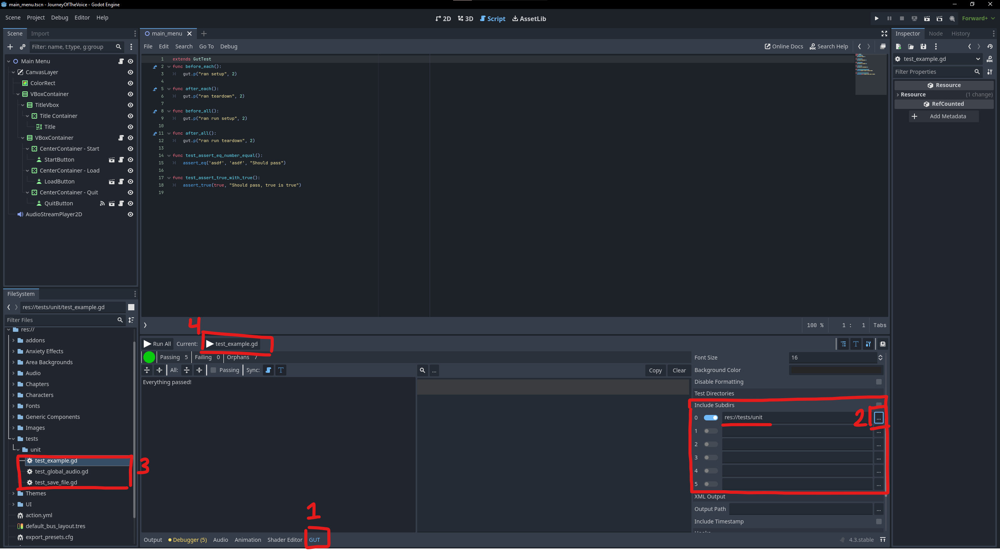

# Journey_Of_The_Voice

**User Manual:**
- Located in the itch.io page and in-game tutorials.
  - https://wearethem.itch.io/journey-of-the-voice

 **Source Code Access:**
 - No special resources excluded from the repo, just clone repo onto your machine.

 **Directory Layout:**
 - .github/workflows: Contains .yml files for running our CI setup for Godot using Github Acctions.
 - Audio: Contains music for the project in .mp3 files.
 - Chapters: contains the content for the game using generic components which includes Chapters, areas, conversations, characters, and .json files for the conversations.
 - Characters: Contains character scenes and art assets.
 - Generic Components: Contains base chapter, area, conversation, monologue, character, and autoload singleton scenes and scripts.
 - UI: Contains UI scenes, scripts, and assets for menus and UI elements.
 - addons/gut: Contains the GUT plugin for unit testing in Godot. Leave it unchanged in the main directory.
 - tests/unit: Contains written unit tests for the game that are run on commit to the repo.

Accessing scenes, scripts, resources, and tools in Godot can be done by double clicking files in the FileSystem

**How to Build the Sofware:**
- In Godot, running the "Play" button will build and run the project in the editor, and "Run Current Scene" builds and runs individual scenes that are runnable.

**How to Run Tests:**
- In Godot, there is a tab labeled "GUT" at the bottom of the editor that opens a menu for running selected GUT test files and viewing test diagnostics.
1. In the editor, open the "GUT" tab.
2. Scroll down to "Test Directories" and press on "..." to find the directory tests/unit.
3. In the file system locate a test file you want to run and double click to select it.
4. Run the test by clicking on the "<test_file>.gd" button next to "Current:" and a results window will appear.

**How to Add New Tests:**
- Under the tests/unit directory add a new test file with the convention "test_[test name].gd" and make sure it extends GutTest.
- Documentation for writing GUT test can be found here: https://gut.readthedocs.io/en/latest/Quick-Start.html#

**How to Build the Project:**
- Download the latest version of Godot:
  - https://godotengine.org/download/windows/
  - Versions for other OS lower in the page
- Clone the main branch of the repository.
- Start Godot and import the project.
- Double click on the imported project to open the project in the editor.
- To run the project press the "Run Project" button at the top right which will open up a new window running the game.

